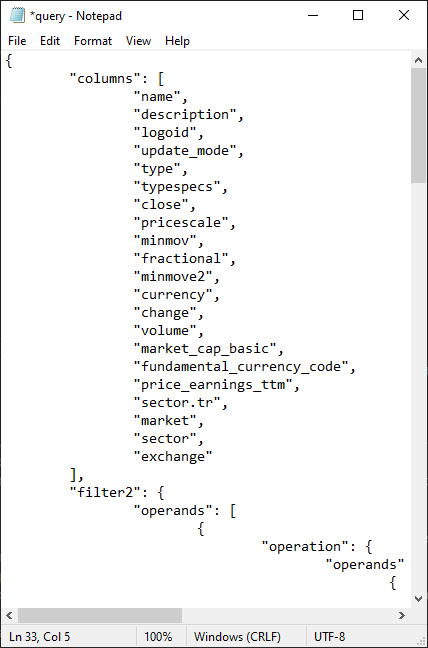

## Introduction

``screenerfetch`` is a Python-based tool for fetching TradingView screener data and saving it neatly in xlsx workbook
file.  
It supports custom queries: you create a custom screener on TradingView website, then simply copy and paste the json request query into this program.

Data is fetched from TradingView's own web API, and is therefore accurate and accessable by anyone.

**In the context of this tool, <u>workbooks</u> can refer to both**
- xlsx (excel) workbook files
- a directory, with its own <u>xlsx</u> files (main file + copies) and other settings files (<u>query.txt</u>, 
<u>headers.txt</u> and <u>settings.json</u>) etc.

## Table of contents

- [Features](#features)
- [Dependencies](#dependencies)
- [How to run](#how-to-run)
- [Set up a new workbook](#set-up-a-new-workbook)
    - [Create workbook files](#create-workbook-files)
    - [Update query](#update-query)
    - [Fetch, preview and save data](#fetch-preview-and-save-data)
- [Customize workbook](#customize-workbook)
    - [Query](#query)
    - [Column headers and numerical data](#column-headers-and-numerical-data)
    - [Update xlsx file headers](#update-xlsx-file-headers)
- [Workbook types](#workbook-types)
    - [Create custom type templates](#create-custom-type-templates)
    - [Example: small_cap1](#example-small_cap1)

## Features

- **Operates on a easy-to-use command line interface**, with plenty of available commands.

    - Support for writing basic scripts (get data, save it etc.) is also provided.

- **Uses ``xlsx`` file format (also known as *excel workbook*) to store all data.**
    
    - Fetch symbol data and preview it before saving. Select which entries to save, or save all of it.
    - Back up your data: uses both automatic and manual system where autocopy is updated each time you close the 
    program, manual copy only when you need one
    - Export your workbooks in ``txt``, ``csv`` and ``json`` formats
    - Remove any duplicates entries if you accidentally fetch same data multiple times
- **Custom queries**: copy your screener settings from TradingView website and simply paste them in a text file to get 
exact same data from API. Data for **Stocks, ETFs, bonds, crypto**, should all be accessable.
- **Custom headers**: use default headers in xlsx files or override them with custom names. Can also customize rounding 
of numerical values for each data column individually e.g. have integers for float/market cap, but round prices to 
decimal count of your choice.

- **Create multiple workbook templates**: each with separate worksheet and settings files. Easy and quick to switch 
between templates. Useful, if you need to store separate data sets for different queries e.g. small caps, large caps, 
etfs etc.

## Dependencies

Following third-party Python packages are needed:

    matplotlib==3.10.1
    numpy==2.2.3
    openpyxl==3.1.5
    pandas==2.2.3
    requests==2.32.3

For quick install, use ``pip install -r requirements.txt`` after changing 
working directory to ``<your path>/screenerfetch``.

## How to run

To run ``screenerfetch``, you either

- run it without any arguments: this opens the full cli program
- pass it arguments, which runs it in scripting mode: it simply runs the corresponding command for each provided 
argument, then closes.

You can use the provided batch files ``run.bat`` and ``run-args.bat``, or just run commands in terminal. Below, batch 
files are assumed to be used.

- ``run`` starts ``screenerfetch`` without arguments, therefore running the <u>full CLI supported program</u>. Use this 
to create new workbooks, update workbook settings with your own query and header values, test fetching and saving. You 
can also test plenty of other commands provided.

- To make simple scripts, use ``run-args``. Requires existing workbook. 
**Remember to edit this file and customize the arguments for your own needs**. Following args are currently available:

    - ``-wb``/``--change-wb`` = select a workbook as current. Make sure the workbook before you change to it exists! 
    Example: ``-wb test_wb`` if a workbook names ``test_wb`` has been created.
    - ``-f``/``--fetch`` = fetch symbol based on your current query settings
    - ``-s``/``--save`` = open ap_data.txt which displays all fetched data. You can then add + in front of all symbol 
    names you want to save in current workbook. *Requires that -f/--fetch has been called once*
    - ``-sa``/``--saveall`` = saves all symbol data in current workbook. *Requires that -f/--fetch has been called once* 
    - ``-c``/``--autocopy`` = creates a copy of current workbook. Overrides the ``autocopy`` file, not the manual 
    ``copy``.
    - ``--export`` = exports workbook data in chosen format. Possible values: ``txt``, ``csv``, ``json`` or ``all`` to 
    export all previous. Default value is ``all``. Example: ``--export json``
    
    **Note that args have a specific order:** -wb -> -f -> -s -> -sa -> -c -> --export. This means that even if you 
    wrote ``test_wb -s -c -f``, it performs fetching, then saving, then copying.  

    **<u>Full example</u>**: ``py screenerfetch -wb test_wb -f -sa -c --export``
    
    - changes workbook to ``test_wb``; this is located in ``screenerfetch/workbooks/test_wb`` directory
    - fetches data
    - saves all data in current workbook ``test_wb.xlsx``
    - creates/overrides existing ``test_wb-autocopy.xlsx``
    - exports workbook data in all supported file types: these are created under ``data`` folder of current workbook.

    <u>Logging</u>
    For logging, you can use special argument ``-log``. Unlike other arguments, using ``py screenerfetch -log`` runs the
     full cli program with logging enabled. But adding any script args will run it as script instead e.g 
     ``py screenerfetch -log -wb test_wb``

Using ``run.bat`` or typing ``py screenerfetch`` if you use command line, should display the following.

This is the default view after opening. It displays

- current ui location (``main``) 
- current workbook (``test``)
- type of workbook (``small_cap1``)

    - ``small_cap1`` is built-in custom template. Normal workbook type is ``basic``. Custom templates are discussed 
    later in last section.

Typing ``help`` displays the short setup guide whereas ``commands`` displays all supported commands.

## Set up a new workbook

**In this section, the name ``new_wb`` is used for workbook. Replace it your own**

### Create workbook files

- type command ``wb``. This lists all available workbooks

    

- enter a name for your workbook. Workbooks cannot include following symbols:  
    ``# % & { } \ / < > * ? $ ! ' " : @ + ´ ' ¨ ` | =`` 
    It also cannot be named ``_default`` which serves as placeholder workbook and must exist in workbooks directory.  
    After you enter workbook name, you are asked to confirm the name. 

    

    Simply type ``yes`` and your workbook files are automatically generated.

    

    ``WB=new_wb`` confirms your new workbook is currently selected and has type ``basic``. 

### Update query
    
Type command ``q``. This opens the query commands menu:

Before you begin this part, **<u>you need a free TradingView account
in order to create custom screeners on website</u>**. This is because you either

1. Create a custom screener on TradingView website, then copy the json data and paste it in this 
program, or
2. Write the screener query manually. But again, you need to know what to write in query so this pretty much
comes back to point 1.

Thus section covers only the point 1.

---

To begin, open your TradingView screener. These have a address with url  
``https://www.tradingview.com/screener/<identifier>/``  
where ``<identifier>`` is a string of numbers and letters. You don&#39;t need to paste this url anywhere; this part
is just to confirm you are on right screen.

Customize your screener to suit your needs. When you&#39;re done, **save your screener** under whatever name you want
to.  
Then, to access the json query of your current screener, do the following steps:

1. press ``F12`` to open web developer tools. You should be on ``Network`` section.

    

2. below the headers, you see a searchbar with text ``Filter URLs``. Click on it and type ``scanner``.
3. refresh your web page (press ``F5``). The filter bar should still display ``scanner``. If not, type it there again.
4. now, you should see a result similar to this

    

    Here, **select the one with** 
    - *Method*: ``POST``
    - *File*: ``scan?label-product=...``.

    It should typically be the top one. The part after ``=`` changes depending on which screener you use. Here, 
    it&#39;s a stock screener and thus says ``scan?label-product=screener-stock``. 

5. A page to the right opens. Select ``Request``. This opens a page with JSON data.

    

    Then simply right click the data area on right and select ``Copy All``. You now have the required query data saved
    on clipboard.  

Now, back to command line interface: type ``query``, press enter.
    

A text window with default values opens:

|  |
|:--:|
| *Default data* |

Simply select all existing text, press ``ctrl+a`` to select all, then paste your copied data to replace default values:

|  |
|:--:|
| *JSON data copied from website. Only a small part of data is displayed here*|

Now, in above query, only selected columns in TradingView were

    Price
    Change %
    Volume
    Market Cap
    P/E
    Sector

You may wonder why are there so many columns. Well, every query from website will unfortunately include extra 
columns, most of which you likely don&#39;t need.   
Best way to remove them is to just test their output,
then remove useless ones after. Good thing is, you can freely edit the query before any data is saved in xlsx 
workbook.  
To do this afterwards can difficult, because you have already saved data under existing headers and would need to pretty
much backup all data somewhere, then format existing  
xlsx file data and apply new headers, then manually paste the data back in.

You could actually remove all the column headers, except one:

**``"name"`` must always exists**.

Without it, screenerfetch throws a critical error.

Simply save ``query.txt`` contents and close the file. Then type ``back`` to return to main screen.

### Fetch, preview and save data

With existing workbook and query, you can now fetch data from web api. Simply type ``f`` or ``fetch``:

To see all the data that fetched, use ``txt`` or ``open txt`` command.

This opens a notepad text window. Here contents are split into 2 images:  
Selected columns are Price, Change %, Volume, Market Cap, P/E, Sector, as already mentioned. Displays data with 
descending market cap order i.e. highest market map first and so on.

Here you can see what the extra columns do: for example,

- description and logoid represent info for current symbol,
- update mode an absolutely useless string that has same value for all symbols,
- type/typespecs symbol type and subtype
- pricescale, minmov, minmove2... again some useless data

and so forth. Opening query again and leaving only symbol name + the desired columns

then fetching and previewing, yields a much cleaner data palette

Finally, save all the data into a workbook file with ``sa`` or ``saveall`` command. You can also save specific data rows
with ``s`` or ``save`` command. To test both, first save all available data. Base value of fetched symbols is always 100
so previous txt file has 100 rows of data displayed. This also means all 100 symbols are saved with saveall:

first 10 out of 100...

...and last 10 out of 100 saved symbols

To test save commands, type ``s`` which opens the exact same window again:

The text mentioned after ``#`` explains the saving system: to save all data for a symbol, add a ``+`` sign in front of
symbol name.

Here, we simply add the following symbols: ``GOOG``, ``GOOGL``, ``JPM`` and ``V``

As you can see, spaces don&#39;t matter, only that ``+`` is before the first symbol letter.

When done, save and close this file. All symbols are saved to ``wb_new.xlsx`` and it&#39;s time to check its contents.  
Type ``e`` or ``excel``, and the xlsx file should open (assuming you have a program that open this file type and have
set it as default program to do so)

When data is stored first time, column are not automatically expanded. Simply double-click the vertical line between
column letters to expand each.

Here we can see that same 10 symbols of 100 are included (rows 2-11)

And so are last 10 (rows 92-101). On top of that, individually saved symbols are also included (rows 102-105).

Now, you can save and close this document.

To exit program, simply type ``exit``. This will also create a automatic copy of your xlsx file called
``new_wb-autocopy.xlsx``.  
 It is found in your workbook folder ``screenerfetch/workbooks/new_wb``.

 This concludes workbook creation process. You should now understand how to
- create workbooks
- update query
- fetchi and save data
- view saved data in xlsx format

But, as you can see, the data in above workbook file uses only default headers and default numerical notation  
To override headers with custom names, or change the display format of numerical values (which also replaces the ``,``
with ``.`` in excel), continue reading onto the next section.

## Customize workbook

### Query

To update query, you can tweak individual settings and test what they do. However, one particularly important is 
``range``:

    "range": [
		0,
		100
	]

This controls how many symbols are fetched from API. It's simply a list with 2 integer values: start and end index, end 
excluded. Default value ``[0,100]`` is for matching up to first 100 symbols are fetched (starts from 0 and ends on 99). 
This means if end index is 100 and available data is found for 80/120 symbols, you get 80/100, respetively.

You should always keep the 0; simply adjust the end index for your liking e.g. ``[0,50]`` and ``[0,500]`` would then get
 you up to 50 and 500 results, respectively. 

### Column headers and numerical data

From main interface, go back to query interface and edit headers with ``headers`` command:

This opens a text file similar to query.txt, this time called ``headers.txt``. It should contain an empty json 
dictionary which looks like this

    {
        {}
    }

To customize column headers and numerical values under these columns, you need to edit corresponding column based on the
letter its assigned in excel files.
First column ``A`` is always the current date, others follow after in the order they are listed under columns.

If for example, you use the following query columns

        "columns": [
		"name",
		"close",
		"change",
		"volume",
		"market_cap_basic",
		"price_earnings_ttm",
		"sector.tr"
	]

you would then use following letter to match columns:

    A = date
    B = name
    C = close
    D = change
    E = volume
    F = market_cap_basic
    G = price_earnings_ttm
    H = sector.tr

With these, you could for example edit header file like this:

    {
        "B": {"name": "Symbol name"},
        "D": {"type": "float", "decimals": 2},
        "E": {"type": "int"},
        "F": {"name": "Market cap", "type": "int"},
        "G": {"name": "P/E", "type": "int"},
        "H": {"name": "Sector"}
    }

<u>Each column explained:</u>  
``A``: No matter how your columns look like, ``A`` is always the first and stands for current date value. It uses 
default value ``date``. This suffices so ``A: {...}`` can be left out.

``B``: First query column is ``name``. This corresponds to second header letter, which is ``B``. To update default value
 to a new one called ``Symbol name``, add ``{"name": "Symbol name"}``.

``C``: Third header is for 2. query column ``close``. This can stay uncustomized so ``C`` row is left out.

``D``: Fourth header is for 3. query column ``change``. This name is good enough so it won&#39;t be changed. Now, 
TradingView data has by default a lot of decimal points included in most numerical values. To set a limit, you first 
define that numbers are treated as decimals with ``"type": "float"``, then add the desired amount of decimal points: 
here 2 is fine so ``"decimals": 2`` is used. Note that number is integer and **must not wrapped in quotations**: 
do **not** use ``"2"``!

``E``: Fifth header matches to 4. column ``volume``. Volume should not need decimal points so simply round it to an 
integer value by using ``"type": "int"``.

``F``: Sixth header matches to 5. column ``market_cap_basic`` which is just market cap. It&#39;s renamed to 
``Market cap`` and rounded to integer value.

``G``: Seventh header matches to 6. column ``price_earning_ttm``. Again, simply rename it to ``P/E`` and round all data 
to integers.

``H``: Eighth and last header matches to 7. column ``sector.tr``. Make the name cleaner by changing it to ``Sector``.

When you&#39;re done with editing headers, make sure the format is correct:
- wrap all values but decimal rounding in quotations ``""``
- have curly brackect ``{}`` around the custom modifiers
- add a comma ``,`` athe end of each row **except last one**
- only include rows with custom changes i.e. don&#39;t do ``"B"`` or ``"B": {},`` etc. just drop the unmodified ones.
- do not use ``"decimals": ...`` without including ``"type": "float"``

Then save the file and your header values are updated.

### Update xlsx file headers

To update existing workbook data, you can use following 3 commands:
- ``update headers``: updates all your xlsx workbook **column names** based on ``headers.txt``.
- ``update nums``: updates all your xlsx workbook column numerical values based on ``headers.txt``, i.e. converts each 
column to its corresponding type (int, float) + possibly rounds decimal values.
- ``update date``: updates date display format to default value 'yyyy/mm/dd' if for some reason this has changed.

If you have a brand new workbook with no data, you are likely to need only ``update headers``. Then afterwards, if 
numerical or date data displays weirdly, use the other 2.

``new_wb.xlsx`` before customized ``headers.txt``

and after customization

As you can see, float values follow more traditional rounding rules (well, negative numbers round exactly the same as 
positives, though).
But integers are always rounded towards floor value - be aware of this so you don&#39;t end up losing any valuable 
information the decimal points might convey.

## Workbook types

When a new workbook is created, it has the type ``basic``. Screenerfetch allows user to create and add code for their 
custom workbook types. Custom workbooks can include 
- custom query and headers value templates by default
- custom commands which are accessed via a new user interface after using ``custom`` command. All commands of ``basic`` 
workbooks can still be used.

### Change type of workbook

To use a new type, you must change the workbook type value and **format** the current workbook file. 
**Formatting will delete all contents of both xlsx and config files**.

Use ``FORMAT WB`` command (this is case sensitive so type it in all uppercase)

Then select workbook type. Initial type is always ``basic``. A built-in custom type ``small_cap1`` is also available, 
which is covered in section [Example: small_cap1](#example-small_cap1).

After typing ``small_cap1``, wb type is now updated.

Also, query and headers data is updated with custom values.

And workbooks start with these default headers, too.

### Create custom type templates

To create a new workbook template
- open your ``screenerfetch`` root directory. Then go to ``screenerfetch/custom`` and create a new folder. Folder name 
matters as this will be the workbook type.
- then, you must implement to commands:
    - workbook create commands: this creates the base template of a ``xlsx`` files of this type
    - custom command interface: this lists all available custom commands after the command ``custom`` is used
- after implementation, add create and interface commands under ``run.py``:
    - find function ``_custom_create()`` and add create command:

            def _custom_create(wb_type: str) -> None:
                .
                .
                .
                # Add workbook creation command of any custom package here
                match wb_type:
                    case 'basic':
                        commands.create()
                    case 'small_cap1':
                        custom.small_cap1.c_workbook_tools.create_custom_wb()
                    case 'your_workbook':       # add case for your type
                        custom.your_workbook.create_command() # then add the command

    - find function ``_select_custom_package()`` and add interface command:

            def _select_custom_package() -> None:
                .
                .
                .
                if wb_type in os.listdir(FilePaths.PATH/'custom'):
                    # add interface access command for any custom package here
                    match wb_type:
                        case 'small_cap1':
                            custom.small_cap1.c_commands.select_custom_command()
                        case 'your_workbook':   # add case for your type
                            custom.your_workbook.interface_command() # then add the interface command
                return

Now, your new workbook type should be avaiable under ``FORMAT WB`` command + you can access its custom command interface
 after typing ``custom``.

### Example: small_cap1

Screenerfetch comes with a workbook called ``test``. This uses the ``small_cap1`` type and some excel data included. As 
name suggests, its symbols consist (mostly) of small cap stocks. To access custom commands, type ``custom``.

This workbook type uses a second worksheet in excel workbooks where you can add data rows, notes and images 
(which must be located in 'small_cap1/images' folder).

Notably, it has built-in data plotting commands which can accessed with ``plot``.

5 different commands can be accessed, each displaying a data plot. Using ``avg daily`` displays average daily candles of
 each day on top graph, and total symbol count of each day as a line graph on bottom

s
and ``daily cs`` displays saved candlestick data for given date:

opens the following figure.

Other 3 commands ``avg lines``, ``dist`` and ``float`` display following images:

